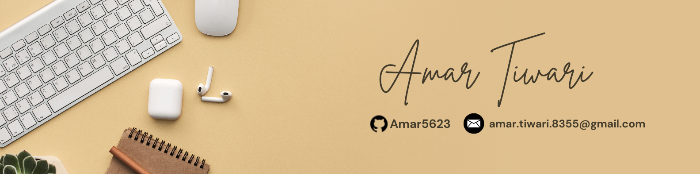

# 🚀 Hey, I'm **Amar Tiwari**  
**Aspiring Data Scientist & Full-Stack Web Developer** from India 🇮🇳  

Bridging the gap between **data and design** to build intelligent and impactful solutions.  
From crunching data to crafting beautiful UIs — I love it all!

---

## 🧠 About Me

- 💻 **Core Skills**: Python, C, JavaScript, SQL, DSA  
- 📊 **Fields I Love**: Data Science, AI, Web Development, Web3, Prompt Engineering  
- 🧠 **Current Focus**: Machine Learning, Smart Contracts, Backend APIs  
- ⚡ **Hackathons**: Led projects at SIH, Odoo x Mindbend, and more 🚀  
- 🌱 **Always Exploring**: Blockchain tech, Data Engineering, GenAI tools  

---
## 💻 Tech Stack

<table>
  <tr>
    <th>🧠 Languages</th>
    <th>🛠 Frameworks & Tools</th>
    <th>🗃 Databases</th>
    <th>🔗 Blockchain/Web3</th>
  </tr>
  <tr>
    <td align="center">
       Python  
       C  
       JavaScript
    </td>
    <td align="center">
       React  
       Node.js  
       Express.js  
       Pandas
    </td>
    <td align="center">
       MongoDB  
       MySQL
    </td>
    <td align="center">
   
  Solidity (basic)  

   
  NFT Metadata  

   
  Smart Contracts
</td>

  </tr>
</table>

---

## 🚀 Featured Projects

| Project | Description |
| ------ | ----------- |
| 🎯 [**Visual Search Assistant**](https://github.com/Amar5623/visual-search-assistant) | An AI-powered tool enabling image-based search. Combines **Python + React**, integrates API calls, and enhances UX with intelligent results. |
| 🖼 [**Aptos NFT Marketplace dApp**](https://github.com/Amar5623/Aptos-NFT-Marketplace-Bounty) | A full-stack marketplace for minting, buying, selling NFTs. Built using **React, TypeScript, Tailwind, and Aptos smart contracts**. Supports auctions, filters, analytics & more. |
| 🛒 [**E-commerce Platform (MERN)**](https://github.com/Amar5623/E-commerce-web-using-react-redux-toolkit-) | A full-fledged shopping platform using **MongoDB, Express, React, Redux Toolkit, and Node.js**. Features product management, cart, and admin panel. |
| 📊 [**Sentiment Analysis Chatbot**](https://github.com/Amar5623/Llama-Chatbot-with-Sentiment-Analysis-Integration) | Combines **chatbot UX with NLP**. Classifies messages as Positive, Negative, or Neutral. Great for mental health and feedback systems. |

---

## 📈 Learning & Growth

📚 Currently diving deeper into:
- ✅ Data Science & Visualization  
- ✅ Deep Learning & Transformers  
- ✅ Blockchain dApps & Contract Security  

---

## 📬 Let's Connect!

 &nbsp;
 &nbsp;
 &nbsp;

---

> 🧠 *"Code, Create, Innovate!"*  
> ✨ *Never stop learning. Never stop building.*  
> 👾 *Open to collaboration and freelance opportunities!*  

